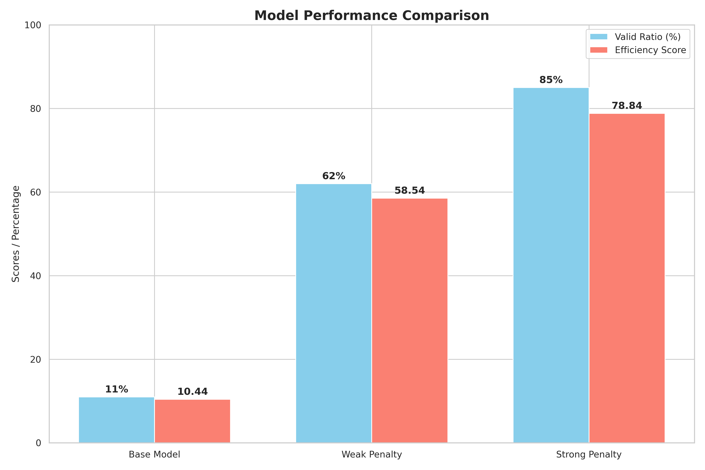
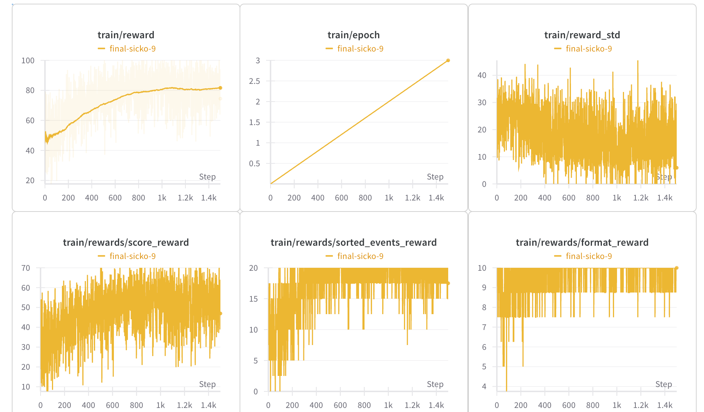
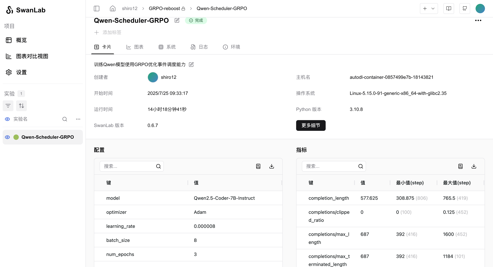

# Planday: An AI-Powered Event Scheduler

This project trains a Qwen language model to act as a precise and optimized event scheduler. It leverages the GRPO (Grounded Reward-based Policy Optimization) algorithm through the `unsloth` library to finetune the model's ability to generate valid and optimal schedules based on a set of rules and a list of events.



## Overview

The core of this project is to teach a large language model the complex task of scheduling. Given a list of events with different durations and priorities, the model learns to generate a conflict-free schedule that maximizes the total weighted duration of included events. This is a classic optimization problem, and this project explores using a powerful LLM to solve it.

The model is trained to first "think" through the problem by generating a reasoning trace, and then output the final, structured schedule in a specific XML-like format.

## How It Works

### 1. Model & Training

-   **Base Model**: The project uses a pre-trained Qwen model, loaded in 4-bit precision for memory efficiency using `unsloth`.
-   **LoRA Finetuning**: To efficiently adapt the model to the scheduling task, it employs Low-Rank Adaptation (LoRA). The LoRA configuration (`grpo_trainer_lora_model/adapter_config.json`) specifies the parameters for this finetuning.
-   **GRPO Algorithm**: The training is performed using `GRPOTrainer`, which implements the GRPO algorithm. This is a form of reinforcement learning that uses reward functions to guide the model towards better outputs, rather than relying solely on a dataset of "correct" examples.

### 2. The Prompt

The model is guided by a carefully crafted prompt that consists of:
-   **System Prompt**: Instructs the model to act as a precise scheduler and to use a "think-then-act" process.
-   **User Prompt**: Defines the strict rules for scheduling, including chronological order, handling of priorities, and conflict resolution. It also specifies the required output format.
-   **Input Events**: A list of events to be scheduled, appended to the prompt at runtime.

### 3. Reward Functions

The "magic" of GRPO lies in its reward functions, which score the model's generated schedules. This project uses a combination of three rewards:
-   **Format Reward (10 points)**: Checks if the output strictly adheres to the required `<think>` and `<schedule>` XML structure.
-   **Sorting Reward (20 points)**: Ensures all events in the generated schedule are in perfect chronological order.
-   **Score Reward (70 points)**: The most crucial reward. It calculates the total weighted duration of the scheduled events and compares it to a pre-calculated optimal score (computed using a classic dynamic programming algorithm). The closer the model's schedule is to the optimal, the higher the reward.

### 4. Training and Evaluation

The training process is logged using SwanLab and Weights & Biases, allowing for real-time monitoring of metrics like loss, rewards, and KL divergence. The `trainlog.txt` file contains the raw log data from a training run.


*(Example of a training run monitored with Weights & Biases)*


*(Example of a training run monitored with SwanLab)*

## How to Run

1.  **Installation**:
    ```bash
    pip install unsloth==2025.7.8 vllm swanlab datasets huggingface_hub
    ```

2.  **Prepare Data**: Ensure your dataset is located at `dataset_generation/generated_dataset`. The project includes scripts to generate this data.

3.  **Start Training**:
    ```bash
    python train_grpo.py
    ```

4.  **Evaluate**: After training, you can use the provided evaluation scripts to test the model's performance:
    ```bash
    python run_evaluation.py
    ```

## Project Structure
-   `train_grpo.py`: The main script for training the model.
-   `prompts.txt`: Contains the system and user prompt templates.
-   `dataset_generation/`: Scripts and data for generating the training dataset.
-   `evaluation/`: Scripts and results for evaluating the model's performance.
-   `grpo_trainer_lora_model/adapter_config.json`: LoRA configuration file.
-   `images/`: Contains images and plots for results visualization.
-   `trainlog.txt`: Raw log output from a training session.
