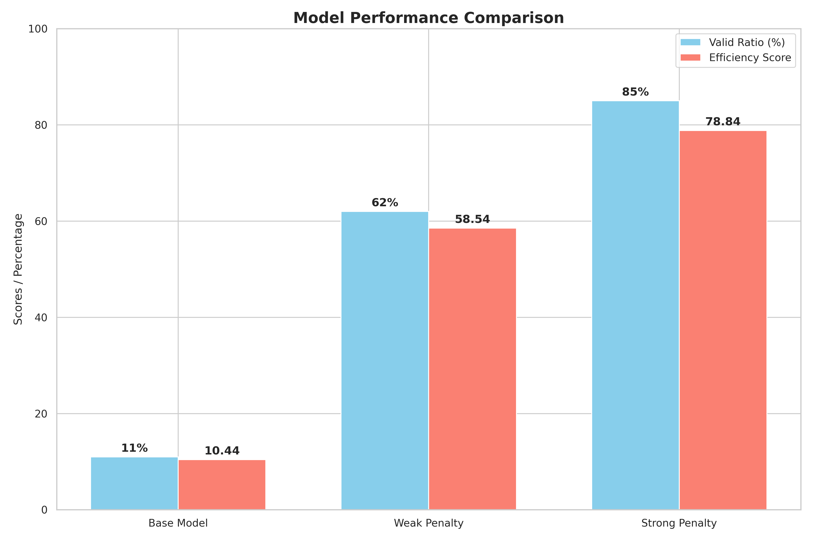
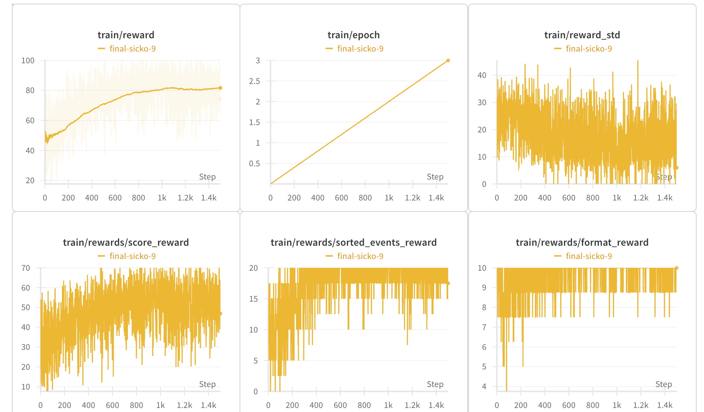
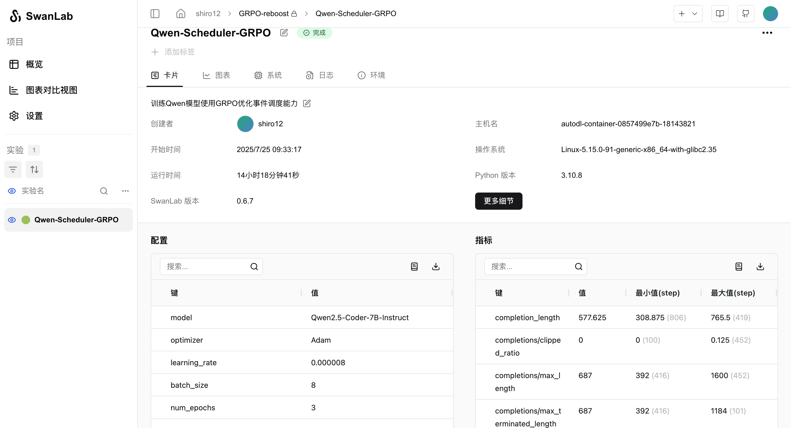
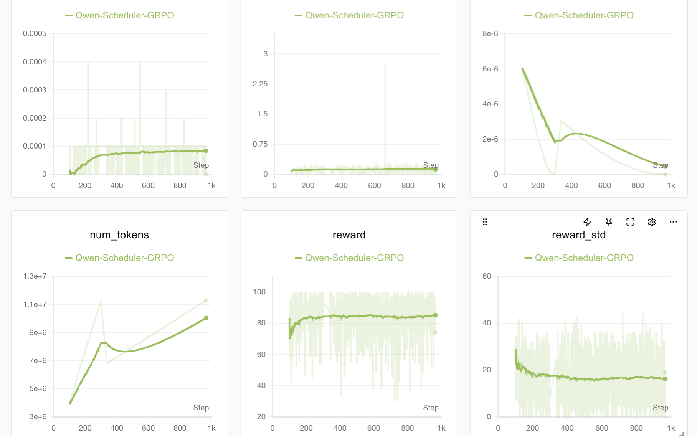

# Planday: AI 驱动的事件调度器

本项目旨在训练一个 Qwen 语言模型，使其能够作为一个精确且经过优化的事件调度器。项目通过 `unsloth` 库利用 GRPO (Grounded Reward-based Policy Optimization) 算法，对模型进行微调，使其能够根据带优先级的事件列表，生成有效且最优的调度方案。



## 项目概述

本项目的核心是教会大语言模型处理复杂的调度任务。给定一系列具有不同时长和优先级的事件，模型将学习生成一个无冲突的、最大化加权事件总时长的调度方案。这是一个经典的优化问题（加权区间调度），本项目探索了使用强大的大语言模型来解决这一问题。

在训练过程中，模型被引导首先通过生成推理轨迹来“思考”问题，然后以特定的格式输出最终的结构化调度方案。

## 工作原理

### 1. 模型与训练

-   **基础模型**: 项目使用预训练的 Qwen 模型，并利用 `unsloth` 以 4-bit 精度加载，以提高内存效率。
-   **LoRA 微调**: 为了使模型能高效地适应调度任务，项目采用了低秩自适应（LoRA）技术。LoRA 的配置文件（`grpo_trainer_lora_model/adapter_config.json`）详细说明了此次微调的参数。
-   **GRPO 算法**: 训练过程使用 `GRPOTrainer` 执行，该训练器实现了 GRPO 算法。这是一种强化学习方法，它使用奖励函数来引导模型生成更优的输出，而不仅仅是依赖于一个包含“正确”答案的数据集。

### 2. 提示工程 (Prompt)

模型由一个精心设计的提示（Prompt）引导，该提示包含：
-   **系统提示 (System Prompt)**: 指示模型使用cot。
-   **用户提示 (User Prompt)**: 定义了严格的调度规则，包括时间顺序、优先级处理和冲突解决。它还规定了所需的输出格式。
-   **输入事件**: 在运行时附加到提示后的一系列待调度事件。

### 3. 奖励函数

本项目结合了三个奖励函数：
-   **格式奖励 (10分)**: 检查输出是否严格遵守所要求的 `<think>` 和 `<schedule>` XML 结构。
-   **排序奖励 (20分)**: 确保生成方案中的所有事件都按完美的时间顺序排列。
-   **得分奖励 (70分)**: 最关键的奖励。它计算调度方案中事件的总加权时长，并将其与通过经典动态规划算法计算出的最优得分进行比较。模型的调度方案越接近最优解，获得的奖励就越高。

### 4. 训练与评估

训练过程使用 Weights & Biases 进行记录，后来被墙了所以改用swandlan(训练过程中遇到点bug，日志前500条被吞了), 可以实时监控损失、奖励和 KL 散度等指标。`trainlog.txt` 文件包含了训练运行的原始日志数据。


*(使用 Weights & Biases 监控的训练过程示例)*


*(使用 SwanLab 监控的训练过程示例)*



## 如何运行

1.  **安装依赖**:
    ```bash
    pip install unsloth==2025.7.8 vllm swanlab datasets huggingface_hub
    ```

2.  **准备数据**: 确保您的数据集位于 `dataset_generation/generated_dataset`。项目中包含了生成此数据的脚本。

3.  **开始训练**:
    ```bash
    python train_grpo.py
    ```

4.  **评估**: 训练结束后，您可以使用提供的评估脚本来测试模型的性能：
    ```bash
    python run_evaluation.py
    ```

## 项目结构
-   `train_grpo.py`: 用于训练模型的主脚本。
-   `prompts.txt`: 包含系统和用户提示模板。
-   `dataset_generation/`: 用于生成训练数据集的脚本和数据。
-   `evaluation/`: 用于评估模型性能的脚本和结果。
-   `grpo_trainer_lora_model/adapter_config.json`: LoRA 配置文件。
-   `images/`: 包含用于结果可视化的图像和图表。
-   `trainlog.txt`: 训练过程中的原始日志输出。
